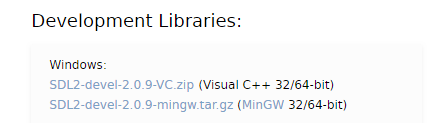
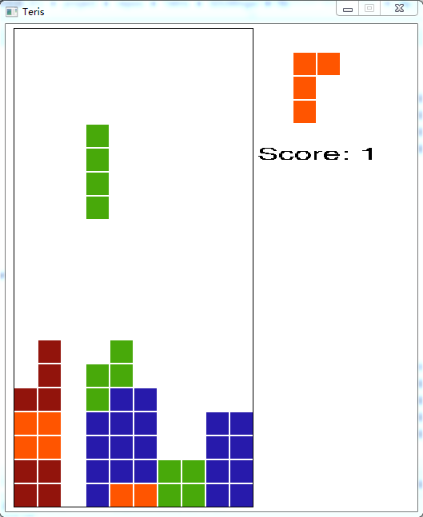

[TOC]

# Teris

## On Linux
1. First install the following libraries
```bash
sudo apt install libsdl2-dev libsdl2-image-dev libsdl2-ttf-dev libsdl2-mixer-dev
```

2. Then run the shell script
```bash
chmod +x compile.sh
./compile.sh
```

3. The former step generates an executable file `tetris`, run it and you're good to go.


## On Windows
There are two choices to compile the project on windows: using mingw32 or visual studio toolkit. Please note that you should download the corresponding libraries compatible to the compiler used. Say if you choose to compile the code with mingw32 compiler, then you should download the libraries specific to mingw32.



**Here I only show how to compile with mingw32 toolset. It should be fairly simliar if you're using visual studio. Explore yourself!**

### Compile with mingw32

1. Install mingw32 toolset.

   First make sure you have the mingw32 toolset installed, instructions could be found [here](http://mingw-w64.sourceforge.net/). After that, you should add the bin folder to the enviroment variable so you could use the tools in the command line.

2. Install the SDL library files.

   The following packages are needed: `SDL2, SDL2_image, SDL2_ttf, SDL2_image`, which are all available in the [SDL website](https://www.libsdl.org). To save your time, I have bundled all the necessary files into one zip file, `SDLMingw.zip`. Just unzip it and put it in the project folder. It should contain two folders, `include` for header files and `lib` for binary libraries (like .dll, .lib).

3. Open a command window and compile.

   Simply type the command `mingw32-make`  and it will compile and link all the stuff. After the compilation, it'll copy the executable program `tetris.exe` and a True Type Font file `micross.ttf` to the `SDLMingw\lib` folder. See why next.

4. Run the program.

   Since the executable program `tetris.exe` relies on some Dynamic Link Libraris (DLL) to function. So you should either add the `SDLMingw\lib` folder to the environment variable or simply copy the executable to the folder `SDLMingw\lib`. Either way should work. I favor the latter. So just switch to folder `SDLMingw\lib` and click on the `tetris.exe` to run the game. Have fun!

## Playing

If everything goes well, you should see something like this. It shows the current game board, a preview of the next brick and the current scores.



**Insturctions**

1. Press `a` and `d` to move the brick left or right respectively;
2. Press `s` to bring down the current brick;
3. Use `j` to flip left right the brick;
4. Use `k` to rotate the brick.

## TODO

- [ ] Check whether it's game over.
- [ ] Introduce some sound effects.
- [ ] An icon would be cool.

